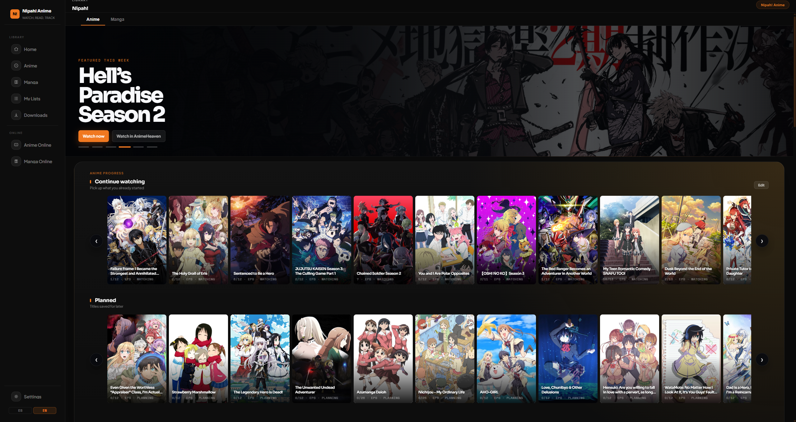
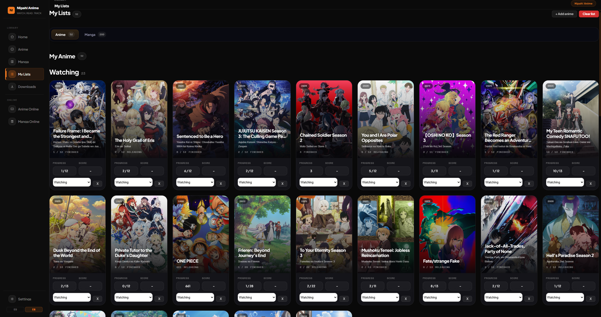
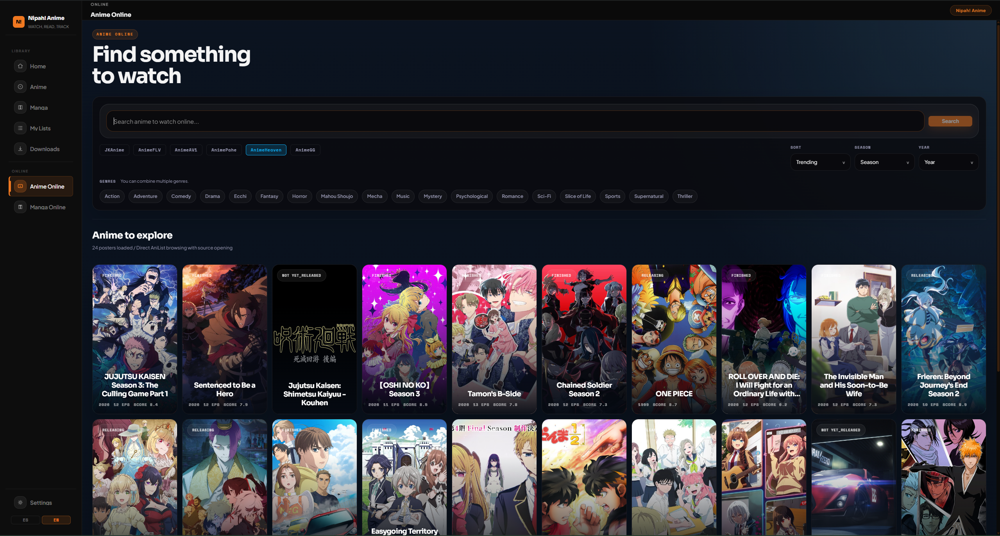
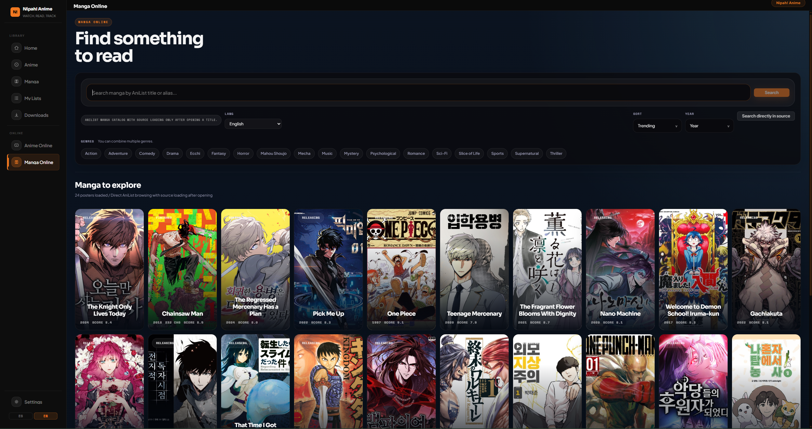

# Nipah! Anime

**A bilingual desktop app for watching anime, reading manga, tracking progress, and syncing everything with AniList.**

 

<a href="#english-readme">🇺🇸 English</a> &nbsp;|&nbsp; <a href="#readme-español">🇪🇸 Español</a>

---

<a href="#readme-español">🇪🇸 Ver en Español</a>

## What is Nipah! Anime?

Nipah! Anime is a **desktop client** for anime and manga fans who want everything in one place: streaming, reading, progress tracking, lists, and AniList sync, without living inside a browser.

Built with **Go, React, and Wails**, it aims to feel fast, native, and focused, with a bilingual UI designed for both Spanish-speaking and English-speaking users.

> **Watch anime. Read manga. Track everything. Sync with AniList. All from your desktop.**

---

## Screenshots

  
  

  
  

---

## Features

### 🎬 Anime
- Online anime search and streaming from multiple sources
- Direct playback through **MPV**
- Continue Watching support on Home
- AniList-powered title matching for difficult aliases
- Automatic AniList progress sync while you watch

### 📖 Manga
- Online manga search with in-app reading flow
- Multiple manga source support
- Continue Reading support on Home
- AniList-backed identity and cover matching
- Manga chapter progress sync with AniList

### 📁 Local Library
- Import local anime and manga folders
- Automatic scans on startup
- Local progress persistence for offline content

### 📋 Lists & Tracking
- Separate anime and manga list views
- Add titles manually from AniList
- Edit status, progress, and score
- Local-first sync queue with retry behavior for AniList jobs

### 🌐 UI & Experience
- **Bilingual interface** - English / Espanol
- Catalog-first Home with anime and manga sections
- Cleaner featured hero, tighter layout, and auto-rotating spotlight
- BlurHash support for local covers
- Desktop notifications
- Anime4K MPV preset support
- Dark desktop-first visual design with black/orange direction

### 🔄 Auto-Updater
- Built-in update checker connected to GitHub Releases
- Changelog shown inside the update flow
- One-click installer launch for new Windows releases

---

## Supported Platforms

- **Windows** via installer
- **Linux** via:
  - `.AppImage` bundled with **WebKit2GTK 4.1**
  - `.deb` package for Ubuntu/Debian-based distros
  - `PKGBUILD` for Arch-based distros

---

## Supported Sources

### Anime
- JKAnime
- AnimeFLV
- AnimeAV1
- AnimePahe
- AnimeHeaven
- AnimeGG

### Manga
- M440
- SenshiManga
- MangaOni
- WeebCentral
- TempleToons
- MangaPill
- MangaFire

Source availability may change over time depending on upstream sites.

---

## Building from Source

OAuth credentials are not included in this repository.

Check `.env.example` for the environment variables needed to register and configure your own AniList app for local development.

Core stack:
- Go
- Wails v2
- React
- Vite

---

## AniList Integration

Nipah! Anime uses **AniList** as its main account and sync provider.

- AniList login
- Anime list sync
- Manga list sync
- Automatic progress syncing from playback and reading

---

## Installation

### Windows
1. Go to the [Releases](https://github.com/NipahDevTeam/Nipah--Anime/releases) page.
2. Download the latest Windows installer.
3. Run the installer.
4. Choose language correctly. This will affect source preference inside the app.
5. Launch **Nipah! Anime** from Start Menu or desktop.

### Linux
Download the format that fits your distro from the latest release:
- `.AppImage`
- `.deb`
- `PKGBUILD`

---

## Requirements

| Requirement | Details |
|-------------|---------|
| OS | Windows 10/11 (64-bit) or modern Linux |
| MPV | Required for anime playback |
| Internet | Required for online sources and AniList sync |

### MPV

Nipah! Anime uses **MPV** for playback.

- On Windows, MPV can be bundled or configured manually
- On Linux, install `mpv` through your package manager

Official site: [mpv.io](https://mpv.io)

---

## Updates

The app includes a built-in updater for Windows releases. When a new version is available:

1. A notification appears on launch.
2. You can read the changelog directly in the popup.
3. Click **Download & Install** to fetch and launch the new installer.

---

## Disclaimer

Nipah! Anime is a **desktop client**. It does not host, store, or distribute media content. Anime and manga are accessed through third-party sources whose availability may change over time.

Use responsibly and in accordance with the laws of your country.

---

 
 

---

<a href="#english-readme">🇺🇸 View in English</a>

## ¿Qué es Nipah! Anime?

Nipah! Anime es un **cliente de escritorio** para fans del anime y el manga que quieren tener todo en un solo lugar: streaming, lectura, seguimiento de progreso, listas y sincronizacion con AniList, sin depender del navegador.

Construido con **Go, React y Wails**, busca sentirse rapido, nativo y enfocado, con una interfaz bilingue pensada tanto para hispanohablantes como para usuarios en ingles.

> **Mira anime. Lee manga. Registra tu progreso. Sincroniza con AniList. Todo desde tu escritorio.**

---

## Capturas de pantalla

  
  

  
  

---

## Funcionalidades

### 🎬 Anime
- Busqueda y streaming de anime en linea desde multiples fuentes
- Reproduccion directa con **MPV**
- Seccion de **Continuar viendo** en Inicio
- Coincidencia de titulos con AniList para aliases dificiles
- Sincronizacion automatica del progreso con AniList mientras ves

### 📖 Manga
- Busqueda de manga en linea con flujo de lectura dentro de la app
- Soporte para multiples fuentes de manga
- Seccion de **Continuar leyendo** en Inicio
- Identidad y portadas apoyadas por AniList
- Sincronizacion de progreso de capitulos con AniList

### 📁 Biblioteca Local
- Importa carpetas locales de anime y manga
- Escaneo automatico al iniciar
- Persistencia de progreso para contenido offline

### 📋 Listas y Seguimiento
- Vistas separadas para anime y manga
- Agregar titulos manualmente desde AniList
- Editar estado, progreso y puntuacion
- Cola de sincronizacion local con reintentos para trabajos de AniList

### 🌐 Interfaz y Experiencia
- Interfaz bilingue: **Espanol / English**
- Inicio orientado a catalogo con secciones de anime y manga
- Hero destacado mas limpio, compacto y rotatorio
- BlurHash para portadas locales
- Notificaciones de escritorio
- Soporte para preset Anime4K en MPV
- Diseno oscuro con direccion visual negro/naranja

### 🔄 Actualizador Automático
- Verificador integrado conectado a GitHub Releases
- Changelog visible dentro del flujo de actualizacion
- Lanzamiento con un clic del instalador nuevo en Windows

---

## Plataformas Soportadas

- **Windows** mediante instalador
- **Linux** mediante:
  - `.AppImage` con **WebKit2GTK 4.1** incluido
  - paquete `.deb` para Ubuntu/Debian y derivados
  - `PKGBUILD` para Arch y derivados

---

## Fuentes Soportadas

### Anime
- JKAnime
- AnimeFLV
- AnimeAV1
- AnimePahe
- AnimeHeaven
- AnimeGG

### Manga
- M440
- SenshiManga
- MangaOni
- WeebCentral
- TempleToons
- MangaPill
- MangaFire

La disponibilidad de las fuentes puede cambiar con el tiempo segun los sitios externos.

---

## Compilar desde el código fuente

Las credenciales OAuth no estan incluidas en este repositorio.

Consulta `.env.example` para ver las variables necesarias y configurar tu propia app de AniList para desarrollo local.

Stack principal:
- Go
- Wails v2
- React
- Vite

---

## Integración con AniList

Nipah! Anime usa **AniList** como proveedor principal de cuenta y sincronizacion.

- Inicio de sesion con AniList
- Sincronizacion de lista de anime
- Sincronizacion de lista de manga
- Envio automatico del progreso desde reproduccion y lectura

---

## Instalación

### Windows
1. Ve a [Releases](https://github.com/NipahDevTeam/Nipah--Anime/releases).
2. Descarga el instalador mas reciente para Windows.
3. Ejecuta el instalador.
4. Elige el idioma correctamente, esto afectara las preferencias de fuentes dentro de la app.
5. Abre **Nipah! Anime** desde el menu Inicio o el escritorio.

### Linux
Descarga desde la ultima release el formato que mejor se adapte a tu distro:
- `.AppImage`
- `.deb`
- `PKGBUILD`

---

## Requisitos

| Requisito | Detalles |
|-----------|---------|
| Sistema Operativo | Windows 10/11 (64-bit) o Linux moderno |
| MPV | Necesario para reproducir anime |
| Internet | Necesario para fuentes en línea y sincronización con AniList |

### MPV

Nipah! Anime utiliza **MPV** como reproductor.

- En Windows puede venir incluido o configurarse manualmente
- En Linux debes instalar `mpv` desde el gestor de paquetes de tu distro

Sitio oficial: [mpv.io](https://mpv.io)

---

## Actualizaciones

La app incluye un actualizador integrado para versiones de Windows. Cuando hay una nueva version disponible:

1. Aparecera una notificacion al iniciar.
2. Puedes leer el changelog directamente en el popup.
3. Haz clic en **Descargar e Instalar** para obtener y lanzar el nuevo instalador automaticamente.

---

## Aviso Legal

Nipah! Anime es un **cliente de escritorio**. No aloja, almacena ni distribuye contenido multimedia. El anime y manga se acceden desde fuentes de terceros cuya disponibilidad puede cambiar con el tiempo.

Úsalo de forma responsable y de acuerdo con las leyes de tu país.

---

Made with ❤️ for anime fans everywhere · Hecho con ❤️ para fans del anime en todo el mundo

