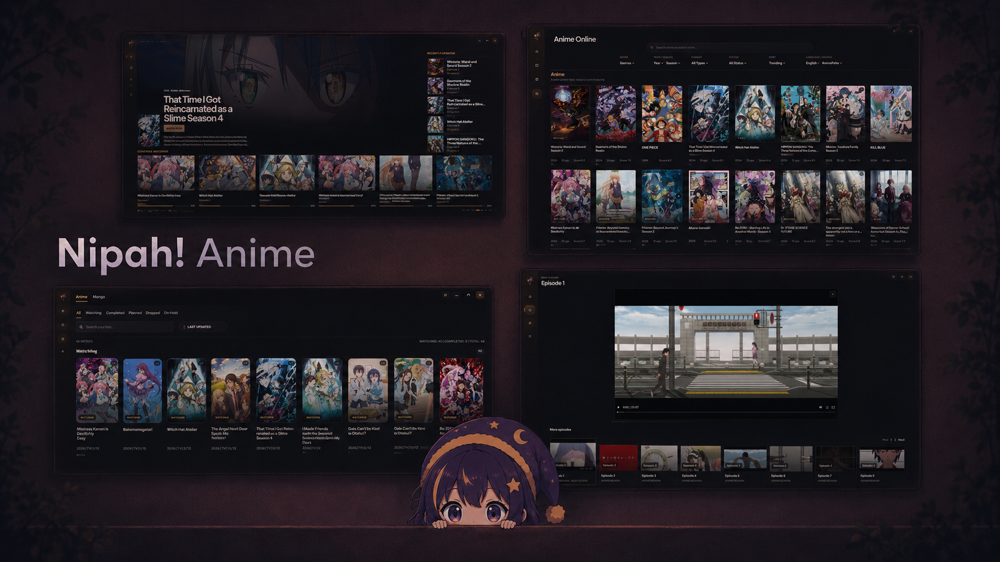

# Nipah! Anime

**A bilingual desktop app for anime streaming, manga reading, AniList sync, and local library management.**  
**Una app de escritorio bilingue para streaming de anime, lectura de manga, sincronizacion con AniList, y gestion de biblioteca local.**

  

---

## English

Nipah! Anime is an app for anime streaming, manga reading, AniList sync, and local library management for a smooth desktop experience.

### Support

You can support the project by starring the repository and sharing it with other anime and manga fans.

### Tech Stack

- Go
- Wails
- React
- Vite
- MPV
- AniList API
- Jikan API

### Feature Highlights

- Stream anime from multiple online providers.
- Watch anime through a fully integrated in-app player built for desktop viewing.
- Read manga with a dedicated reader.
- Sync anime and manga progress with AniList in the same workflow.
- Keep streaming, reading, tracking, and list management in one place.
- Bilingual desktop experience built for both English and Spanish users.
- Manage personal lists with score, progress, status, and date editing.

---

## Español

Nipah! Anime es una app de streaming de anime, lectura de manga, sincronizacion con AniList y gestion de biblioteca local.

### Apoyo

Puedes apoyar el proyecto dándole una estrella al repositorio y compartiéndolo con otros fans del anime y el manga.

### Tech Stack

- Go
- Wails
- React
- Vite
- MPV
- AniList API
- Jikan API

### Funcionalidades Destacadas

- Reproduce anime desde multiples proveedores online.
- Mira anime con un reproductor totalmente integrado dentro de la app.
- Lee manga con un lector dedicado pensado para sesiones largas.
- Sincroniza el progreso de anime y manga con AniList dentro del mismo flujo.
- Mantiene visualización, lectura, seguimiento y gestion de listas en un solo lugar.
- Ofrece una experiencia bilingue pensada para usuarios de ingles y español.
- Permite gestionar listas personales con puntuacion, progreso, estado y fechas.

---

## Legal / Aviso

Nipah! Anime is a desktop client and does not host, store, or distribute anime, manga, or any other media content. All content is accessed through third-party providers, and provider availability, quality, language options, and playback behavior may change or disappear at any time without notice.

Users are responsible for how they use the application and for complying with the laws, regulations, and content access rules that apply in their country or region.
