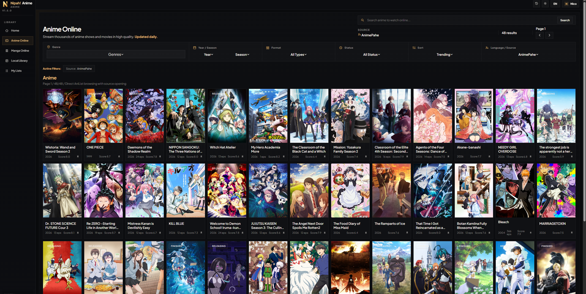
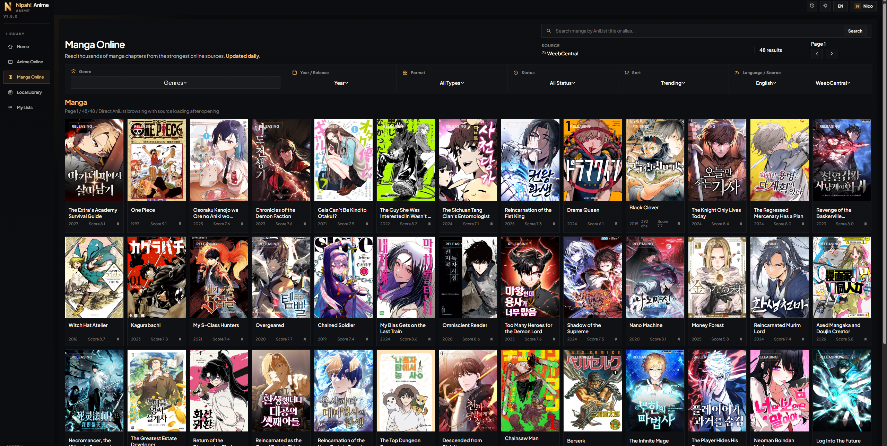

# Nipah! Anime

**A desktop app for anime, manga, and AniList sync.**  
**Una app de escritorio para anime, manga, y sincronizacion con AniList.**

  

  
  

---

## English

Nipah! Anime brings anime streaming, manga reading, AniList sync, and local library management into one desktop app.

### Donations

Nipah! Anime is a one-man project, developed and constantly maintained by yours truly. If you are enjoying Nipah! Anime and it has been of use to you, please consider supporting me:

**BTC**  
`bc1q806k3948azqzc97nr0u3cp39ynevjm8jdvlsk4`

You can also support me by giving this repo a star and sharing it with others.

### Tech Stack

- Go
- Wails
- React
- Vite
- MPV
- AniList API

### Feature Highlights

- Stream anime from multiple online providers inside one desktop app.
- Read manga with a dedicated reader built for long reading sessions.
- Sync anime and manga progress with AniList.
- Keep watching, reading, and list management in the same workflow.
- Use a bilingual desktop experience built for English and Spanish users.
- Manage personal lists with score, progress, status, and date editing.
- Use premium desktop-focused navigation, smoother transitions, and stronger library UX.
- Mix online usage with local library management in one place.

---

## Espanol

Nipah! Anime reune streaming de anime, lectura de manga, sincronizacion con AniList y gestion de biblioteca local en una sola app de escritorio.

### Donaciones

Nipah! Anime es un proyecto desarrollado y mantenido constantemente por una sola persona. Si te ha gustado Nipah! Anime, considera apoyarme para seguir trabajando en el proyecto:

**BTC**  
`bc1q806k3948azqzc97nr0u3cp39ynevjm8jdvlsk4`

Tambien puedes apoyar el proyecto dandole una estrella al repositorio y compartiendolo con otras personas.

### Tech Stack

- Go
- Wails
- React
- Vite
- MPV
- AniList API

### Funcionalidades Destacadas

- Reproduce anime desde multiples proveedores online dentro de una sola app de escritorio.
- Lee manga con un lector dedicado pensado para sesiones largas.
- Sincroniza el progreso de anime y manga con AniList.
- Mantiene visualizacion, lectura y gestion de listas dentro del mismo flujo.
- Ofrece una experiencia bilingue pensada para usuarios de ingles y espanol.
- Permite gestionar listas personales con score, progreso, estado y fechas.
- Usa una interfaz de escritorio con transiciones mas suaves y una experiencia de biblioteca mas cuidada.
- Combina uso online con gestion de biblioteca local en un solo lugar.

---

## Legal / Aviso

Nipah! Anime is a desktop client and does not host, store, or distribute anime, manga, or any other media content. All content is accessed through third-party providers, and provider availability, quality, language options, and playback behavior may change or disappear at any time without notice.

Users are responsible for how they use the application and for complying with the laws, regulations, and content access rules that apply in their country or region.
