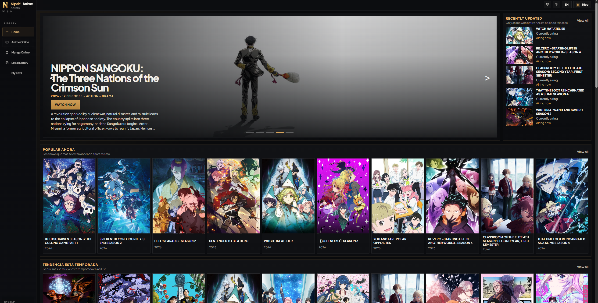

# Nipah! Anime

**A bilingual desktop app for anime and manga.**  
**Una aplicación de escritorio bilingüe para anime y manga.**

Watch, read, organize, and track your progress from one polished desktop experience with AniList sync, local library support, and multiple online providers.  
Mira, lee, organiza y sigue tu progreso desde una sola experiencia de escritorio, con sincronización con AniList, biblioteca local y múltiples proveedores online.

  <a href="#english">English</a> · <a href="#espanol">Español</a>

  

  
  

---

## English

### Overview

Nipah! Anime is a desktop app designed to bring anime streaming, manga reading, tracking, and library management into one place. Made for users who prefer a clean desktop workflow instead of having to juggle browser tabs, anime/manga tracking, and readers separately.

With support for both English and Spanish users, Nipah! Anime has a practical interface for all necessary everyday tools: AniList sync, anime playback through MPV, in-app manga reading, and local library support for users who keep their own media collections with the possibility of downloading directly from providers.

### Features

- Stream anime from multiple online providers.
- Download episodes directly and have them be automatically tracked and managed.
- Read manga inside the app with a dedicated manga reader.
- Sync anime and manga progress with AniList.
- Manage separate anime and manga lists in one desktop client.
- Browse modern anime and manga catalog easily.
- Keep a local library for offline or self-managed content.
- Switch between English and Spanish.

### Providers

#### Anime

- `JKAnime` [ES]
- `AnimeFLV` [ES]
- `AnimeAV1` [ES] [Dubbed Anime available] [Direct download available]
- `AnimePahe` [EN] [Dubbed Anime available] [Direct download available]
- `AnimeHeaven` [EN]
- `AnimeGG` [EN]

#### Manga

- `M440` [ES]
- `SenshiManga` [ES]
- `MangaOni` [ES]
- `MangaFire` [EN/ES]
- `MangaPill` [EN]
- `WeebCentral` [EN]
- `TempleToons` [EN]

Provider availability may change over time depending on upstream services.

---

## Español

### Descripción general

Nipah! Anime es una aplicación de escritorio la cual junta streaming de anime online, lectura de manga, seguimiento y gestión de biblioteca en un solo lugar. Pensada para usuarios que esten cansados de depender de múltiples pestañas, listas y lectores separados en el navegador.

Con soporte para usuarios en inglés y español, Nipah! Anime posee una interfaz con herramientas realmente útiles para el día a día: sincronización con AniList, reproducción de anime mediante MPV, lectura de manga dentro de la app y soporte para biblioteca local para quienes conservan su propio contenido, con la posibilidad de descarga directa de episodios en varios proveedores.

### Funcionalidades

- Reproduce anime desde múltiples proveedores online.
- Descarga episodios directamente y deja que sean manejados automáticamente por la app.
- Lee manga dentro de la app con un lector dedicado.
- Sincroniza el progreso de anime y manga con AniList.
- Administra listas separadas de anime y manga en un solo cliente de escritorio.
- Explora catálogos de anime y manga
- Mantén una biblioteca local para contenido offline o gestionado por ti.
- Cambia entre inglés y español en una experiencia bilingüe de escritorio.

### Proveedores

#### Anime

- `JKAnime` [ES]
- `AnimeFLV` [ES]
- `AnimeAV1` [ES] [Doblaje disponible] [Descarga directa disponible]
- `AnimePahe` [EN] [Doblaje disponible] [Descarga directa disponible]
- `AnimeHeaven` [EN]
- `AnimeGG` [EN]

#### Manga

- `M440` [ES]
- `SenshiManga` [ES]
- `MangaOni` [ES]
- `MangaFire` [EN/ES]
- `MangaPill` [EN]
- `WeebCentral` [EN]
- `TempleToons` [EN]

La disponibilidad de los proveedores puede cambiar con el tiempo según los servicios externos.
